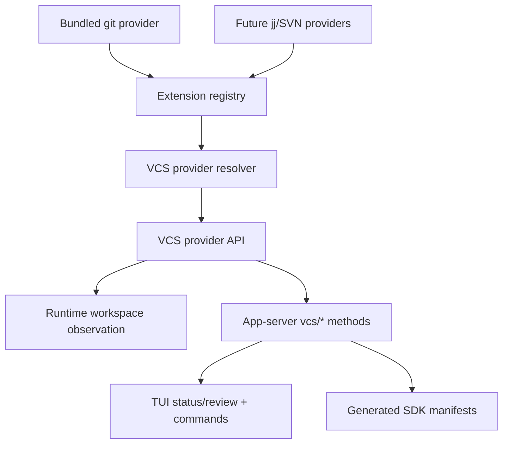
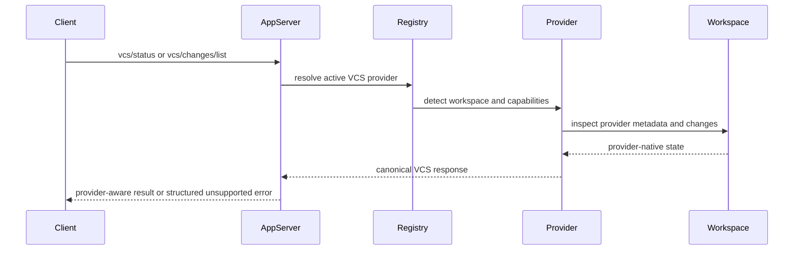
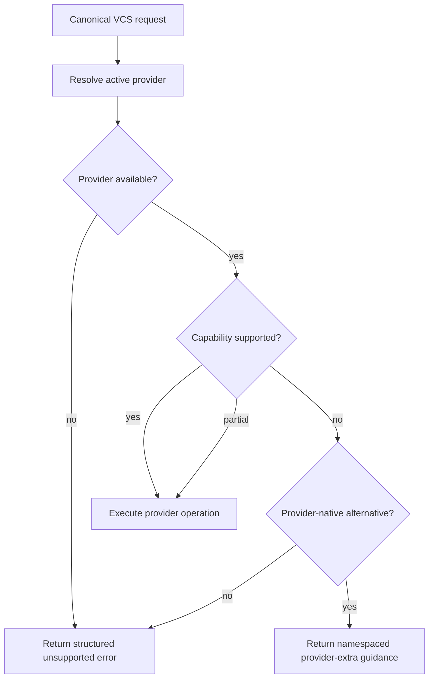

# feat: Add version control provider extension

## Summary

Add a first-class version-control provider subsystem so Roder can run provider-neutral review, snapshot creation, restore, line-switching, and sync workflows, with git shipped as the bundled default provider. This plan replaces the current git-specific app-server/runtime surface with canonical `vcs/*` protocol methods and provider capabilities while preserving git behavior through an included git extension.

---

## Problem Frame

The current implementation has git-specific logic in app-server change review, runtime workspace-change observation, TUI status, slash commands, and the built-in commit skill. That solves the default git case but makes jj, Subversion, and future VCS providers awkward because core workflows assume git branch, merge-base, diff, and staging semantics.

The requirements doc frames the target as a provider subsystem, not a thin command abstraction: Roder should normalize agent outcomes such as inspect, select, create a provider history snapshot, restore, switch line of work, and sync, while providers expose capability data and namespaced extras for native behavior (see origin: `docs/brainstorms/2026-06-01-version-control-extension-requirements.md`).

---

## Requirements

**Provider Contract**

- R1. Define a stable native VCS provider API in the extension-facing API layer, with canonical types for workspace identity, active line of work, capabilities, changed files, diff pages, selection, provider history snapshot creation, restore, line operations, sync operations, provider-native extras, provider errors, and provider detection claims. Preserves origin R1-R3, R6-R17.

- R2. Register VCS providers through the existing extension registry and advertise VCS service entries in extension manifests, with git installed through the same mechanism as other bundled extensions. Preserves origin R5 and R25.

- R3. Support deterministic active-provider detection for workspaces, including no-provider degradation and overlapping provider claims exercised by fake providers; real jj/SVN metadata resolution remains deferred until those providers exist. Preserves origin R3, R4, and the origin assumptions.

**Git Provider and Behavior Parity**

- R4. Extract git-specific status, changed-file listing, diff reading, and base resolution into a bundled git provider without losing the existing review behavior for branch deltas, staged/unstaged work, untracked files, binary files, and paged patches. Preserves origin AE1.

- R5. Implement git-backed selection, provider history snapshot creation, restore, line listing/switching, and sync capabilities where safe, and expose unsupported or partial behavior explicitly through provider capability data and structured errors. Preserves origin R9-R16 and F3-F5.

- R6. Provide fake or test VCS providers that exercise no-provider, unsupported-operation, partial-capability, and provider-native-extra behavior without depending on external VCS binaries. Preserves origin AE2-AE5.

**Protocol, Runtime, and Client Surfaces**

- R7. Replace canonical app-server review methods with `vcs/*` methods and generated schema entries, rather than adding long-lived `git/*` aliases. Preserves origin R23-R24.

- R8. Update workspace-change observation to be version-control reconciled with provider provenance, not git-reconciled, while preserving observed-after-tool semantics. Preserves origin R19.

- R9. Update TUI status, review surfaces, command descriptions, and built-in skills to use provider-neutral VCS language while retaining git-friendly wording in git workspaces. Preserves origin R18, R20-R22.

- R10. Update generated SDK type manifests, app-server documentation, extension documentation, and protocol contract tests so public clients see the new `vcs/*` surface and supported capability/error semantics. Preserves origin R15, R23-R25.

---

## Key Technical Decisions

- KTD1. **VCS lives in `roder-api`, not app-server.** The provider trait and canonical types should sit beside other extension-facing provider contracts so app-server, runtime, TUI, and future providers depend on one stable contract instead of copying DTOs around.

- KTD2. **Git moves to a bundled extension crate.** The existing git helper logic should migrate into an included git provider crate installed by `roder-extension-host`; app-server becomes a consumer of the active provider instead of the owner of git behavior.

- KTD3. **VCS snapshot is the commit-like term, not `CheckpointStore`.** The existing extension API already has `ProvidedService::CheckpointStore(CheckpointStoreId)` for thread/session checkpoint persistence. The VCS operation should use distinct naming, such as `vcs/snapshot/create`, and docs should explain that it is a provider-owned history snapshot that may map to git commit, jj change finalization, SVN commit, or another provider equivalent.

- KTD4. **Canonical operations use capability gates.** Selection, provider history snapshot creation, restore, line switching, and sync should be represented even when unsupported, because clients and agents need to choose safe fallbacks before invoking an operation.

- KTD5. **`vcs/*` is the canonical public surface.** The repo guidance says not to carry backwards-compatibility shims for new forward-moving surfaces, so the plan replaces `git/*` methods and docs rather than expanding both families.

- KTD6. **Provider-native extras are discoverable but namespaced.** Extras are useful for jj operation logs or SVN working-copy details, but they should not add provider-specific fields to the canonical status, VCS snapshot, or diff model.

- KTD7. **Core uses an injected VCS resolver, not git shell access.** Runtime workspace-change code should receive a provider resolver derived from the extension registry at runtime construction, so `roder-core` depends only on `roder-api` traits and does not reach into `roder-extension-host` or global registry state.

- KTD8. **Provider calls are async and return canonical VCS errors.** The provider trait should be async; blocking implementations such as git are responsible for moving process work off async execution. All unsupported, unavailable, path-invalid, dirty-workspace, command-failed, and provider-native-required cases should flow through a shared VCS error type before app-server maps them to JSON-RPC errors.

- KTD9. **Each implementation unit should keep the tree green.** Breaking renames such as `WorkspaceChangeSource::GitReconciled` must land in the same unit as their affected callers/tests/schema regeneration, or be delayed until the unit that updates the full visible surface.

- KTD10. **ACP/app-server compatibility is explicit.** New protocol capabilities should only be advertised after handler and wire-level coverage exists; unsupported paths should return clear JSON-RPC errors rather than silently degrading.

---

## High-Level Technical Design

### Provider Topology



The provider API is the single source of truth for VCS behavior. Git is included by default, but app-server and runtime code should not shell out to git directly once the provider boundary exists. Runtime owns a resolver handle built from the active extension registry, which keeps `roder-core` pointed at `roder-api` traits instead of the default extension host.

### Request Flow



The same resolution path should back review, snapshot creation, restore, line, and sync methods. Unsupported capability responses should be typed outcomes, not command stderr.

### Capability Decision Flow



Capability data should be present before mutation-oriented calls so UI and agent workflows can avoid invoking operations the active provider cannot perform.

---

## Output Structure

Expected new or renamed layout:

```text
Cargo.toml
crates/
  roder-api/src/version_control.rs
  roder-extension-host/Cargo.toml
  roder-ext-git/
    Cargo.toml
    src/lib.rs
    src/provider.rs
    src/git.rs
    tests/git_provider.rs
docs/
  roder-version-control-extensions.md
```

The root `Cargo.toml` must register `crates/roder-ext-git` as a workspace member when the crate is introduced. Existing app-server, protocol, runtime, TUI, command, skill, SDK, and docs files remain in their current locations and are updated in place.

---

## Implementation Units

### U1. Version control provider contract

**Goal:** Add the canonical async VCS provider trait, provider IDs, capability types, response models, error type, provider detection claims, resolver abstraction, and registry plumbing.

**Requirements:** R1, R2, R3, R6

**Dependencies:** None

**Files:**

- `crates/roder-api/src/version_control.rs`
- `crates/roder-api/src/extension.rs`
- `crates/roder-api/src/lib.rs`
- `crates/roder-api/Cargo.toml`
- `crates/roder-api/src/workspace_changes.rs`
- `crates/roder-api/src/tui_status.rs`
- `crates/roder-core/src/runtime.rs`

**Approach:** Introduce provider-neutral types before moving behavior. The provider contract should include async detection, status/change reading, capability inspection, mutation-oriented methods, namespaced extras, canonical `VcsError` variants, and a resolver abstraction that can be injected into runtime/app-server code. Trait methods should return `Result<_, VcsError>`; blocking providers such as git own their process isolation through `spawn_blocking`, an existing command runner, or equivalent provider-local containment. Extend `ProvidedService`, `ExtensionRegistry`, and `ExtensionRegistryBuilder` with VCS provider registration and lookup helpers. Document the detection conflict policy in this unit, with explicit configuration taking precedence over provider claims and then deterministic claim priority/tie-breaking. Avoid public serialized renames in this unit unless all affected callers and schemas move in the same unit; otherwise define the replacement type and migrate usage later.

**Patterns to follow:** Existing extension registry slots in `crates/roder-api/src/extension.rs`, provider ID type aliases, and capability status modeling in `crates/roder-api/src/capabilities.rs`.

**Test scenarios:**

- In `crates/roder-api/src/version_control.rs`, serialize and deserialize VCS capability sets containing supported, unsupported, partial, and provider-native operation states.
- In `crates/roder-api/src/extension.rs`, registering a fake VCS provider advertises `ProvidedService::VersionControlProvider` and appears in the built registry.
- In `crates/roder-api/src/extension.rs`, duplicate VCS provider IDs fail registry validation consistently with other duplicate provider classes.
- In `crates/roder-api/src/version_control.rs`, fake providers with overlapping detection claims resolve deterministically according to the documented priority policy, including a tie case that returns a stable provider or a clear ambiguous-provider error.
- In `crates/roder-api/src/version_control.rs`, canonical `VcsError` variants serialize enough provider, operation, path, command, and capability context for app-server JSON-RPC mapping.
- In `crates/roder-api/src/version_control.rs`, the async provider trait can wrap a fake blocking provider without requiring app-server or runtime callers to own blocking process details.
- In `crates/roder-api/src/workspace_changes.rs`, version-control-reconciled observations roundtrip with provider identity metadata.
- In `crates/roder-api/src/tui_status.rs`, VCS status snapshots serialize provider identity and line-of-work fields without git-specific names when the full consumer surface is migrated in the same unit.

**Verification:** The API crate exposes provider-neutral VCS types, errors, resolver, and registry methods without app-server-specific dependencies, and the tree remains compiling for all callers affected by any serialized type rename in this unit.

### U2. Bundled git provider extension

**Goal:** Move existing git status, changed-file listing, diff reading, base resolution, and untracked-file handling into a bundled git provider extension.

**Requirements:** R2, R3, R4, R6

**Dependencies:** U1

**Files:**

- `Cargo.toml`
- `crates/roder-extension-host/Cargo.toml`
- `crates/roder-extension-host/src/lib.rs`
- `crates/roder-ext-git/Cargo.toml`
- `crates/roder-ext-git/src/lib.rs`
- `crates/roder-ext-git/src/provider.rs`
- `crates/roder-ext-git/src/git.rs`
- `crates/roder-ext-git/tests/git_provider.rs`
- `crates/roder-app-server/src/git_changes.rs`
- `crates/roder-app-server/tests/e2e.rs`

**Approach:** Port the command execution and parsing logic from the existing app-server git helper into the git extension. Keep the current git behavior as the parity target: root detection, branch name, merge-base base selection, committed branch delta, staged/unstaged work, untracked text and binary files, totals, truncation, and paged patch reads. Install the provider in the default registry.

**Execution note:** Add characterization coverage around the current git behavior before deleting the app-server-owned helper.

**Patterns to follow:** Extension crates such as `crates/roder-ext-webwright` and `crates/roder-ext-runner-unix-local`; current git behavior in `crates/roder-app-server/src/git_changes.rs`.

**Test scenarios:**

- In `crates/roder-ext-git/tests/git_provider.rs`, a normal git repo reports provider ID `git`, repository root, active branch, base ref/sha, head sha, changed files, totals, and truncation.
- Covers AE1. In `crates/roder-ext-git/tests/git_provider.rs`, a branch with committed changes plus staged, unstaged, untracked text, and untracked binary files matches the existing app-server e2e behavior.
- In `crates/roder-ext-git/tests/git_provider.rs`, paged changed-content reads return stable offsets, total line counts, next offsets, and repository-relative path validation errors.
- In `crates/roder-ext-git/tests/git_provider.rs`, binary untracked files return a binary changed item without attempting UTF-8 patch construction.
- In `crates/roder-extension-host/src/lib.rs`, the default registry includes the git VCS provider manifest and registry slot.

**Verification:** Existing git review behavior is reproducible through the provider, and the app-server no longer owns git command parsing as its primary implementation path.

### U3. VCS mutation and capability workflows

**Goal:** Implement canonical provider operations for selection, provider history snapshot creation, restore, line-of-work, sync, and provider-native extras with capability-aware behavior.

**Requirements:** R1, R5, R6

**Dependencies:** U1, U2

**Files:**

- `crates/roder-api/src/version_control.rs`
- `crates/roder-ext-git/src/provider.rs`
- `crates/roder-ext-git/src/git.rs`
- `crates/roder-ext-git/tests/git_provider.rs`
- `crates/roder-api/src/extension.rs`

**Approach:** Define canonical mutation request/result types and implement the git provider's safe equivalents. Selection should advertise the supported granularity before snapshot creation. `vcs/snapshot/create` should map to git commit behavior in git workspaces while remaining explicitly orthogonal to the existing thread/session `CheckpointStore` subsystem. Restore should support provider-safe path or hunk behavior only where the provider can do it reliably. Line operations should cover branch listing/switching for git. Sync should expose fetch/pull/push-style capabilities separately so providers can support only parts of the set. Provider-native extras should be discoverable under provider namespaces without changing canonical response fields.

**Patterns to follow:** Existing structured error approach in `crates/roder-protocol/src/lib.rs` and existing provider capability patterns from inference capabilities.

**Test scenarios:**

- Covers AE2. In `crates/roder-api/src/version_control.rs`, a fake provider that lacks hunk selection reports unsupported capability data and produces an unsupported-operation error when hunk selection is requested.
- Covers AE5. In `crates/roder-api/src/version_control.rs`, a fake provider exposes a namespaced provider-native extra without adding provider-specific fields to canonical status responses.
- In `crates/roder-ext-git/tests/git_provider.rs`, path-scoped `vcs/snapshot/create` creates a git commit containing only the requested eligible paths and returns a provider snapshot identity.
- In `crates/roder-ext-git/tests/git_provider.rs`, restore rejects absolute or escaping paths and restores supported relative paths without touching unrelated files.
- In `crates/roder-ext-git/tests/git_provider.rs`, line listing reports local git branches and line switching changes the active branch or returns a structured dirty-workspace error when unsafe.
- In `crates/roder-ext-git/tests/git_provider.rs`, sync capability data distinguishes fetch, pull, and push availability even when the test repo has no remote configured.

**Verification:** Agent-facing workflows can inspect capabilities before mutation, and unsupported operations fail as provider-aware VCS errors rather than raw command failures.

### U4. App-server and protocol `vcs/*` surface

**Goal:** Replace the git-specific protocol surface with canonical `vcs/*` app-server methods and generated schemas.

**Requirements:** R7, R10

**Dependencies:** U1, U2, U3

**Files:**

- `crates/roder-protocol/src/lib.rs`
- `crates/roder-protocol/src/methods.rs`
- `crates/roder-protocol/src/schema.rs`
- `crates/roder-app-server/src/server.rs`
- `crates/roder-app-server/src/lib.rs`
- `crates/roder-app-server/src/git_changes.rs`
- `crates/roder-app-server/src/client.rs`
- `crates/roder-app-server/src/method_manifest.rs`
- `crates/roder-app-server/tests/e2e.rs`
- `schemas/app-server/roder-app-server.v1.json`
- `schemas/app-server/methods.schema.json`

**Approach:** Add DTOs and method specs for canonical VCS status, changed-file listing, changed-content reading, selection, `vcs/snapshot/create`, restore, line, sync, and extras discovery. Route handlers through the active provider resolved from the runtime workspace or request workspace. Remove `git/changes/list` and `git/changes/read` from the manifest and handler table as canonical methods only after scanning app-server, SDK, and ACP/client bridges for consumers. Keep side-effect metadata accurate: read-only for status/list/read/extras, local state for selection/snapshot/restore/line switching, and external process or local state for sync according to the operation's real behavior and no-remote capability state.

**Patterns to follow:** Method manifest generation in `crates/roder-protocol/src/methods.rs`, app-server handler dispatch in `crates/roder-app-server/src/server.rs`, and e2e request helpers in `crates/roder-app-server/tests/e2e.rs`.

**Test scenarios:**

- Covers AE1. In `crates/roder-app-server/tests/e2e.rs`, `vcs/status`, `vcs/changes/list`, and `vcs/changes/read` report the same git branch-delta behavior currently covered by the git change review e2e test.
- Covers AE4. In `crates/roder-app-server/tests/e2e.rs`, `vcs/status` in a non-VCS workspace returns a clear unavailable provider state and review methods return structured VCS unavailable errors.
- Covers AE2. In `crates/roder-app-server/tests/e2e.rs`, a fake provider with unsupported hunk selection exposes capability data and rejects hunk selection with a provider-aware JSON-RPC error.
- In `crates/roder-app-server/src/method_manifest.rs`, handler names and manifest names match after removing `git/*` and adding `vcs/*`.
- In `crates/roder-protocol/src/schema.rs`, checked app-server schema files match the generated manifest/schema.
- In `crates/roder-app-server/tests/e2e.rs`, mutation methods have side effects and errors that match their method manifest metadata.
- Before deleting `git/*` handlers, a compatibility scan across SDK consumers, app-server clients, protocol docs, and ACP/app-server bridge code finds no remaining canonical consumer, or the plan is revised to update that consumer in this unit.
- In `crates/roder-protocol/src/methods.rs`, sync methods do not claim external-process behavior for no-remote or unavailable capability states that never reach a remote process.

**Verification:** Public app-server clients can discover and call the `vcs/*` methods through the generated manifest, and `git/*` is no longer part of the canonical app-server contract.

### U5. Runtime observation, TUI, commands, and skills

**Goal:** Update user-facing and runtime workflows from git-specific language to provider-neutral VCS behavior.

**Requirements:** R8, R9

**Dependencies:** U1, U2, U4

**Files:**

- `crates/roder-core/src/workspace_changes.rs`
- `crates/roder-core/src/runtime.rs`
- `crates/roder-core/tests/agent_loop.rs`
- `crates/roder-tools/src/shell.rs`
- `crates/roder-tools/src/exec.rs`
- `crates/roder-api/src/workspace_changes.rs`
- `crates/roder-api/src/tui_status.rs`
- `crates/roder-tui/src/status_line.rs`
- `crates/roder-tui/src/app/commands.rs`
- `crates/roder-commands/src/lib.rs`
- `crates/roder-commands/tests/expand.rs`
- `crates/roder-skills/src/builtin.rs`
- `crates/roder-skills/builtin/commit/SKILL.md`
- `crates/roder-skills/src/metadata.rs`
- `docs/app-server/api.md`

**Approach:** Route workspace-change baseline capture and post-tool reconciliation through the injected VCS resolver from runtime construction, including provider provenance in observations. Replace direct `Command::new("git")` access in `workspace_changes.rs` with calls against an `Arc<dyn VcsProviderResolver>` or equivalent handle stored on runtime state; the resolver is built by the layer that already owns the extension registry, then passed into core so core does not import `roder-extension-host`. Rename the existing git-specific TUI status context to a VCS status snapshot and render provider plus line of work. Update built-in command and skill wording so the canonical workflow is provider-neutral while the git provider still uses familiar commit terms in git workspaces. Pick one canonical command name in this unit and update callers/tests to it, rather than carrying `/commit` and a snapshot command as parallel aliases.

**Patterns to follow:** Current workspace-change observation tests in `crates/roder-core/src/workspace_changes.rs`, status segment rendering in `crates/roder-tui/src/status_line.rs`, and built-in command catalog tests in `crates/roder-tui/src/app/commands.rs`.

**Test scenarios:**

- In `crates/roder-core/src/workspace_changes.rs`, observed-after-tool reconciliation reports provider-neutral source and provider ID for git workspaces.
- In `crates/roder-core/src/runtime.rs`, runtime construction injects a VCS resolver into workspace-change observation without depending on `roder-extension-host`, and a fake resolver can be substituted in tests.
- In `crates/roder-core/src/workspace_changes.rs`, no direct `git` process invocation remains after provider-backed reconciliation is wired.
- Covers AE4. In `crates/roder-core/src/workspace_changes.rs`, no-provider workspaces skip reconciliation without breaking shell/exec tool completion.
- In `crates/roder-tui/src/status_line.rs`, status rendering shows provider identity and active line of work when present, and omits empty VCS state when unavailable.
- In `crates/roder-tui/src/app/commands.rs`, help text and command matching reflect the provider-neutral VCS snapshot workflow and preserve expected slash-menu behavior.
- In `crates/roder-commands/tests/expand.rs`, the built-in snapshot command expands to provider-neutral instructions and includes git-specific guidance only as a git-provider case.
- In `crates/roder-skills/src/builtin.rs`, the built-in skill asset no longer asserts generic `git status` language outside git-specific guidance.

**Verification:** A user sees VCS state and VCS snapshot language rather than hardcoded git wording, and runtime observations remain available for git workspaces through the provider.

### U6. SDKs, docs, and contract hygiene

**Goal:** Regenerate SDK manifests, update public docs, and add final contract checks for the new VCS surface.

**Requirements:** R7, R10

**Dependencies:** U4, U5

**Files:**

- `sdk/codegen/README.md`
- `sdk/codegen/generate-typescript.mjs`
- `sdk/codegen/generate-python.mjs`
- `sdk/typescript/src/types.generated.ts`
- `sdk/typescript/dist/src/types.generated.js`
- `sdk/typescript/dist/src/types.generated.d.ts`
- `sdk/python/src/roder_sdk/types_generated.py`
- `docs/app-server/api.md`
- `docs/roder-sdk.md`
- `docs/roder-extension-api.md`
- `docs/roder-version-control-extensions.md`
- `README.md`
- `schemas/app-server/roder-app-server.v1.json`
- `schemas/app-server/methods.schema.json`

**Approach:** Treat the app-server JSON-RPC contract as the public boundary. Regenerate TypeScript and Python manifests from the checked schema, update app-server docs with `vcs/*` request/response examples and capability/error behavior, add extension-author docs for implementing a VCS provider, and note that git is bundled by default. Include ACP/app-server compatibility guidance only for capabilities that are actually implemented and covered.

**Patterns to follow:** SDK codegen instructions in `sdk/codegen/README.md`, app-server maintenance checklist in `docs/app-server/api.md`, and extension API docs in `docs/roder-extension-api.md`.

**Test scenarios:**

- Before finalizing SDK/docs updates, `rg "git/changes|GitReconciled|git snapshot"` across `crates`, `sdk`, `docs`, and ACP-related bridge code finds only deliberate migration notes or git-provider-specific examples.
- In `sdk/codegen/generate-typescript.mjs --check`, the generated TypeScript manifest includes `vcs/*` methods and excludes canonical `git/*` methods.
- In `sdk/codegen/generate-python.mjs --check`, the generated Python method literal includes `vcs/*` methods and excludes canonical `git/*` methods.
- In `crates/roder-protocol/src/schema.rs`, the checked schema file matches the generated app-server method enum after codegen.
- Documentation examples in `docs/app-server/api.md` use provider-neutral VCS method names, provider capability fields, and structured unsupported errors.
- `README.md` and `docs/roder-version-control-extensions.md` describe git as bundled and other VCS providers as extension implementations without promising unsupported ACP or hosting behavior.

**Verification:** Generated SDK files are current, public docs do not mention `git/*` as the canonical review API, and extension authors have enough provider guidance to implement a non-git VCS later.

---

## Scope Boundaries

### Deferred to Follow-Up Work

- Implementing real jj and SVN providers. This plan creates the provider contract and git implementation; non-git providers can follow once the contract is proven.

- Rich provider-specific UI for jj operation logs, SVN working-copy metadata, or similar native views beyond namespaced extras discovery.

- Process-isolated or WASM provider execution.

- Cross-repository orchestration across unrelated VCS roots.

### Outside This Feature's Identity

- GitHub, GitLab, or other hosting workflows such as pull request creation and review comments.

- A universal staging model. The canonical model supports selection, not forced git-index semantics.

- A universal branch model. Providers expose line-of-work concepts according to their own model and capabilities.

- Replacing provider-native CLIs for every advanced workflow.

---

## System-Wide Impact

- **Protocol:** App-server method names, generated schemas, and SDK method literals change from git-specific to VCS-specific.

- **Runtime:** Tool-execution change observation depends on active VCS provider resolution instead of git command availability.

- **Extension host:** The default registry gains a new provider category and a bundled git extension.

- **TUI and skills:** User-visible status and VCS snapshot language becomes provider-neutral while still feeling natural in git workspaces.

- **Docs and downstream clients:** API consumers must migrate to `vcs/*` methods and capability-aware workflows.

---

## Risks & Dependencies

- **Provider contract overreach:** The first version may try to model too much native VCS behavior. Mitigation: keep canonical fields focused on agent-critical workflows and route unusual behavior to provider-native extras.

- **Git parity regressions:** Moving git logic behind a provider boundary could subtly change review output. Mitigation: characterize current git branch-delta behavior before removing the app-server helper path.

- **Unsafe mutation workflows:** VCS snapshot, restore, branch switching, and sync can mutate user work. Mitigation: require capability checks, structured errors, path validation, and conservative git-provider implementations.

- **Provider resolution gap:** Core currently shells out to git directly for workspace observations, while providers live behind the extension registry. Mitigation: make the resolver injection design part of U1/U5 and test core with a fake resolver before removing direct git calls.

- **Intermediate breakage in a multi-agent repo:** Public serialized names such as `GitReconciled` have broad caller/schema blast radius. Mitigation: each unit keeps the tree green and lands serialized renames only with all affected callers and generated artifacts.

- **Schema/client drift:** Changing method names affects SDK and app-server clients. Mitigation: rely on method-manifest tests, checked schema generation, and SDK codegen checks.

- **ACP/client compatibility:** Do not advertise VCS capabilities to ACP or app-server clients until handler behavior, error paths, and docs match the implemented surface.

- **Concurrent repo work:** The project has multiple agents working simultaneously. Implementation should ignore unrelated dirty work and avoid broad refactors outside the listed surface.

---

## Documentation / Operational Notes

- Update `docs/app-server/api.md` in the same implementation slice that changes method names so client-facing docs never describe stale `git/*` methods as canonical.

- Add `docs/roder-version-control-extensions.md` as the extension-author entry point for VCS providers, including capability semantics and git-as-bundled-provider behavior.

- Update `docs/roder-sdk.md` if SDK helpers or examples mention the old git review methods.

- Note in `README.md` that git is the bundled VCS provider and that additional VCS systems are extension-provider work, not core forks.

---

## Sources / Research

- Origin requirements: `docs/brainstorms/2026-06-01-version-control-extension-requirements.md`

- Current git review implementation: `crates/roder-app-server/src/git_changes.rs`

- Current app-server handler and e2e surface: `crates/roder-app-server/src/server.rs`, `crates/roder-app-server/tests/e2e.rs`

- Current protocol DTOs and method manifest: `crates/roder-protocol/src/lib.rs`, `crates/roder-protocol/src/methods.rs`, `crates/roder-protocol/src/schema.rs`

- Current extension registry pattern: `crates/roder-api/src/extension.rs`, `crates/roder-extension-host/src/lib.rs`

- Current runtime observation model: `crates/roder-core/src/workspace_changes.rs`, `crates/roder-api/src/workspace_changes.rs`

- Current TUI, command, and skill wording: `crates/roder-tui/src/status_line.rs`, `crates/roder-tui/src/app/commands.rs`, `crates/roder-commands/src/lib.rs`, `crates/roder-skills/builtin/commit/SKILL.md`

- Current SDK codegen path: `sdk/codegen/README.md`, `sdk/codegen/generate-typescript.mjs`, `sdk/codegen/generate-python.mjs`

- Project constraints: `AGENTS.md`, `roadmap/foundations/roder_extensibility_foundations_extensions.md`, `.agents/skills/maintain-acp-compliance/SKILL.md`
