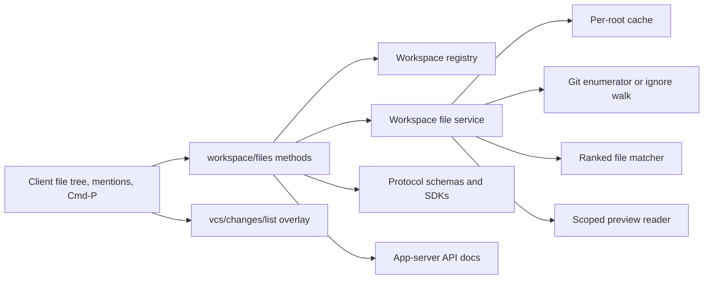
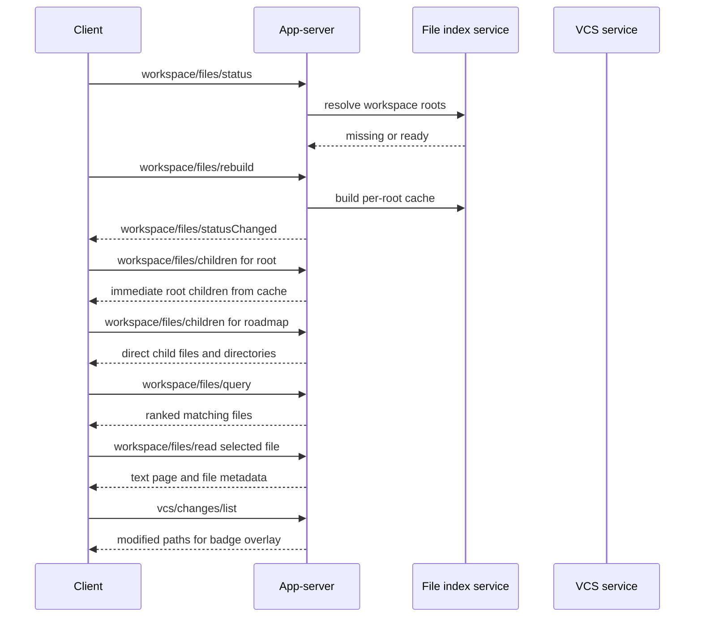
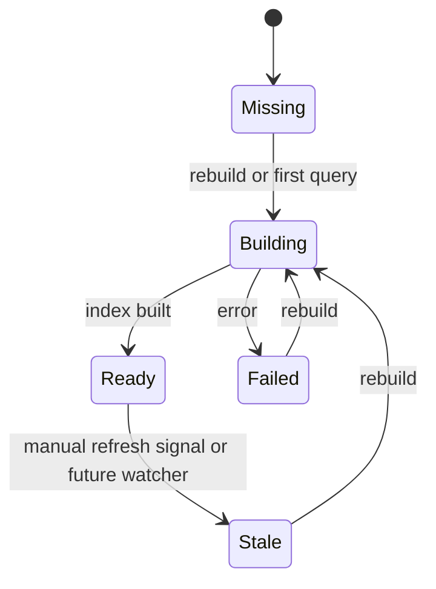

# feat: Add Workspace File Index API

## Summary

Add a workspace-scoped file service to the app-server so clients can build fast file trees, file panes, file search, `@mentions`, and command-palette quick-open from one shared index.

The canonical API should not be a deeper version of `fs/readDirectory`. It should be a new `workspace/files/*` surface that is rooted in registered workspace roots, cached in the app-server, queryable with ranked fuzzy matching, and able to serve preview reads without exposing arbitrary host paths. The screenshot-style UI is a primary target: a left tree that opens and expands lazily, a search box that ranks files across the whole workspace, and a right preview pane that reads selected files.

The first release should prioritize the biggest latency wins: move recursive indexing out of the renderer, add per-root app-server caching, use a git-aware enumerator where possible, and provide a server-side query path. Watcher-backed live deltas can follow once `@mentions` and command-palette consumers exist.

---

## Problem Frame

The current file-pane contract is shallow, pull-based, renderer-recursive, and stateless:

- `fs/readDirectory` lists one absolute host directory at a time.
- The renderer owns the directory walk, which costs one process boundary round-trip per directory.
- File lists are rebuilt when project selection or root ordering changes, even if the underlying root paths are unchanged.
- The existing cap used to protect UI performance becomes a correctness bug for global file search, `@mentions`, and command-palette quick-open.
- Search is panel-local and substring-oriented, so it cannot become the shared ranked matcher for multiple clients.

This does not fit the broader app-server design. The app-server already has workspace registration, index status/rebuild patterns, method manifests, generated schemas, and documented client contracts. File indexing should become a workspace service in that same model rather than remain panel-owned IPC choreography.

---

## Requirements

- **R1. Workspace scope:** New file tree, search, and preview APIs resolve through `workspaceId` and `rootId`, not arbitrary absolute paths.
- **R2. Lazy tree support:** Clients can request children for the workspace root or any indexed directory without recursively walking from the renderer.
- **R3. Complete file index:** The app-server builds a complete file list for each root without a correctness cap. Result limits are allowed for query responses, not for the underlying index.
- **R4. Fast git path:** Git repositories use an ignore-respecting git enumerator where possible, including tracked files and untracked non-ignored files. Non-git roots fall back to an ignore-aware filesystem walk.
- **R5. Per-root caching:** A root can be revisited without re-indexing if the canonical root path and index options have not changed.
- **R6. Stable workspace composition:** Selecting a different root or reordering roots must not invalidate identical per-root caches.
- **R7. Ranked query:** One shared ranked matcher supports tree search, `@mentions`, and command-palette quick-open.
- **R8. Preview read:** Clients can read a selected file through the workspace-scoped API with metadata for large, binary, or non-UTF-8 files.
- **R9. Status visibility:** Clients can observe index state such as missing, building, ready, stale, and failed, and can request a rebuild.
- **R10. VCS composition:** File entries stay focused on filesystem shape. Git badges and modified markers are overlaid from the existing `vcs/*` APIs.
- **R11. Public contract hygiene:** Protocol structs, method manifests, schemas, SDKs, docs, and e2e tests are updated together.
- **R12. No compatibility shims:** Do not add transitional aliases or legacy duplicate APIs. Migrate file-browser documentation and any local callers to the new canonical surface.

---

## Key Technical Decisions

- **KTD1. Introduce `workspace/files/*` as the canonical API.** Do not turn `fs/readDirectory` into a recursive indexer. The new surface is workspace-scoped and client-safe by construction.
- **KTD2. Keep the app-server as index owner.** The renderer asks for status, children, query results, and reads. It does not coordinate breadth-first traversal.
- **KTD3. Cache by canonical root.** The cache key is based on canonical root identity and index options, not selected root, root ordering, or panel mount state.
- **KTD4. Hide enumeration strategy behind the service.** Prefer git enumeration for repositories and use `ignore::WalkBuilder` fallback for non-git roots. Do not expose git-specific behavior in the public protocol.
- **KTD5. Synthesize directories from file paths.** The index stores files as the durable complete list. Directory nodes are derived for tree children, with a direct child scan fallback for empty directories if needed.
- **KTD6. Query in the app-server first.** Server-side matching is the canonical behavior because it scales to large repositories and supports non-panel consumers. Renderer or worker matching can be added later as an optimization for small indexes.
- **KTD7. Keep VCS status separate.** Modified icons in the tree are produced by matching file paths against `vcs/changes/list`, not by duplicating VCS state into the file index.
- **KTD8. Defer watchers.** The first version exposes status, cache, and rebuild. Watcher-backed deltas can be added later without changing the basic `children`, `query`, or `read` shape.
- **KTD9. Keep generated contracts authoritative.** Update protocol structs, method manifests, JSON schemas, generated SDK types, and app-server docs in the same change.
- **KTD10. Avoid large-file growth in `server.rs`.** Put indexing, path resolution, ranking, and read semantics in a dedicated app-server module and keep handlers thin.

---

## High-Level Technical Design

### Proposed Method Shape

Names are illustrative but should stay close to this shape unless implementation finds a clearer local convention:

- `workspace/files/status`
- `workspace/files/rebuild`
- `workspace/files/children`
- `workspace/files/query`
- `workspace/files/read`
- `workspace/files/statusChanged`

Core DTO concepts:

- Workspace locator: `workspaceId`, optional `rootId`, and a relative directory or file path.
- File entry: root identity, relative path, basename, kind, size, modified time, and child availability for directories.
- Query result: file entry plus rank and match positions when useful for highlighting.
- Read result: encoding, text page, byte range, total size, truncation flag, and binary or unsupported-text metadata.
- Status result: one aggregate workspace status plus per-root statuses.

---

## Scope Boundaries

In scope:

- Add the canonical workspace-scoped file API.
- Add an app-server-owned index/cache service.
- Add lazy tree children, ranked query, preview reads, status, rebuild, and status notifications.
- Add git-aware and fallback enumeration.
- Update protocol structs, method manifest, schemas, generated SDKs, and app-server docs.
- Add unit, schema, manifest, and app-server e2e coverage.
- Migrate documentation and any local file-browser consumers away from `fs/readDirectory`.

Out of scope for this plan:

- Building the external desktop file-pane UI.
- Watcher-backed live deltas.
- Persistent on-disk file index storage.
- Content search or semantic search.
- Duplicating VCS status in file entries.
- Client-side worker matching as the canonical query path.
- Compatibility aliases for old file-pane behavior.

---

## Implementation Units

### U1. Protocol, Manifest, And Schema Surface

Define the public contract for the new workspace file service.

Files:

- `crates/roder-protocol/src/lib.rs`
- `crates/roder-protocol/src/methods.rs`
- `crates/roder-protocol/src/schema.rs`
- `schemas/app-server/methods.schema.json`
- `schemas/app-server/roder-app-server.v1.json`

Design notes:

- Add request/response structs for status, rebuild, children, query, read, and status-change notification payloads.
- Mark read-style methods as read-only where appropriate and rebuild as state-changing local work.
- Keep relative path fields explicit. Avoid accepting absolute host paths in new DTOs.
- Use stable method names under `workspace/files/*`.

Tests:

- `crates/roder-protocol/src/schema.rs`
- `crates/roder-protocol/src/methods.rs`

Test scenarios:

- Generated schema includes every new workspace file method and notification payload.
- Method manifest remains sorted, unique, and side-effect metadata is correct.
- DTO JSON round trips preserve root IDs, relative paths, entry kinds, status values, and read metadata.
- Absolute paths are not represented as valid child/query/read locators in the new protocol structs.

### U2. Workspace File Service And Per-Root Cache

Create the app-server module that owns enumeration, cache state, directory synthesis, and root resolution.

Files:

- `crates/roder-app-server/src/workspace_files.rs`
- `crates/roder-app-server/src/lib.rs`
- `crates/roder-app-server/src/workspaces.rs`
- `crates/roder-app-server/Cargo.toml`

Design notes:

- Keep this logic out of `server.rs` except for wiring.
- Store cache entries per canonical root, not per selected workspace view.
- Build a complete file index without a hard correctness cap.
- Use git-aware enumeration for repositories and an ignore-aware walk fallback for non-git roots.
- Derive directory children from indexed file paths, while preserving a path for empty directory visibility if implementation needs it.
- Run blocking filesystem and process work away from the async reactor.

Tests:

- `crates/roder-app-server/src/workspace_files.rs`

Test scenarios:

- Nested file paths synthesize the expected directory hierarchy.
- Cache hits survive workspace switch-back and root reorder when canonical roots are identical.
- Git ignored files are excluded and untracked non-ignored files are included.
- Non-git roots enumerate through the fallback walker.
- Requests for paths outside a registered root fail before filesystem access.
- Large synthetic trees build completely and do not stop at the old file-pane cap.

### U3. App-Server Handlers, Notifications, And Wire Tests

Wire the service into the app-server request path with thin handlers and observable status transitions.

Files:

- `crates/roder-app-server/src/server.rs`
- `crates/roder-app-server/src/workspace_files.rs`
- `crates/roder-app-server/src/method_manifest.rs`
- `crates/roder-app-server/tests/e2e.rs`

Design notes:

- Resolve `workspaceId` and `rootId` through the existing workspace registry.
- Emit status-change notifications when rebuilds start, succeed, fail, or become stale.
- Avoid adding panel-specific concepts such as selected root or root order to handler state.
- Keep failures structured enough for SDK clients to display actionable UI.

Tests:

- `crates/roder-app-server/tests/e2e.rs`
- `crates/roder-app-server/src/method_manifest.rs`

Test scenarios:

- A client registers a workspace, rebuilds the file index, receives a status notification, and then reads root children.
- Expanding `roadmap` returns only direct child entries, not the whole subtree.
- Querying after rebuild returns ranked files across all registered roots.
- Reading a selected file returns text metadata and a bounded text page.
- Invalid workspace IDs, root IDs, and relative paths return structured errors.
- Method manifest coverage includes the new handlers.

### U4. Ranked Query And Preview Read Semantics

Implement the behavior that makes the same index useful for tree search, `@mentions`, and command-palette quick-open.

Files:

- `crates/roder-app-server/src/workspace_files.rs`
- `crates/roder-app-server/tests/e2e.rs`

Design notes:

- Rank exact basename matches above path segment matches, path substring matches, and weaker subsequence matches.
- Keep query result limits separate from index completeness.
- Return stable identifiers so clients can open a result without re-resolving absolute paths.
- Treat preview reads as text-aware and bounded. Large, binary, and unsupported-encoding files return metadata that lets the pane render a clear non-text state.

Tests:

- `crates/roder-app-server/src/workspace_files.rs`
- `crates/roder-app-server/tests/e2e.rs`

Test scenarios:

- Exact basename matches outrank deeper path-only matches.
- Segment-aware fuzzy matches outrank weak subsequence matches.
- Query limits trim the response but not the cached file count.
- Hidden or ignored files are absent when the enumerator should filter them.
- UTF-8 reads do not split characters at page boundaries.
- Binary files do not return accidental text content.

### U5. SDKs, Docs, And Client Contract

Expose the new API to clients and document the intended tree/search/preview flow.

Files:

- `docs/app-server/api.md`
- `docs/app-server/protocol.md`
- `sdk/codegen/README.md`
- `sdk/fixtures/fake-app-server/README.md`
- `sdk/fixtures/fake-app-server/workspace-files-flow.jsonl`
- `sdk/typescript/src/types.generated.ts`
- `sdk/typescript/test/fixtures.test.ts`
- `sdk/python/src/roder_sdk/types_generated.py`
- `sdk/python/tests/test_fixtures.py`

Design notes:

- Document `workspace/files/*` as the file-browser, quick-open, and mention API.
- Show the screenshot-style flow: status, rebuild if needed, root children, expanded directory children, query, preview read, and VCS overlay.
- Stop presenting `fs/readDirectory` as the API for a workspace file browser. If implementation finds no remaining valid low-level consumer, remove it instead of deprecating it.
- Regenerate SDK types from the schema rather than editing generated files by hand.

Tests:

- `crates/roder-protocol/src/schema.rs`
- `sdk/typescript/test/fixtures.test.ts`
- `sdk/python/tests/test_fixtures.py`

Test scenarios:

- Generated TypeScript and Python SDKs include all new request and response types.
- Generated method literals match the manifest and schema.
- Fake app-server fixtures include a complete workspace file flow: status, rebuild notification, children, query, and read.
- TypeScript and Python SDK fixture tests can replay the workspace file flow without permissive hand-written adapters.
- Documentation examples use workspace IDs, root IDs, and relative paths only.
- Docs describe VCS badges as an overlay from `vcs/changes/list`.

### U6. File-Browser Migration Cleanup

Remove redundant old file-browser assumptions so clients have one forward-moving path.

Files:

- `crates/roder-app-server/src/fs.rs`
- `crates/roder-app-server/src/server.rs`
- `crates/roder-protocol/src/lib.rs`
- `crates/roder-protocol/src/methods.rs`
- `docs/app-server/api.md`
- `docs/app-server/protocol.md`

Design notes:

- Do not add wrappers that translate old file-pane flows onto the new service.
- Migrate any local file-browser references to `workspace/files/*`.
- Keep or remove low-level `fs/readFile` and `fs/readDirectory` based on actual remaining non-browser use, but do not extend them for recursive tree loading.
- If a method is removed, update protocol, manifest, schema, docs, and tests in the same unit.

Tests:

- `crates/roder-app-server/tests/e2e.rs`
- `crates/roder-protocol/src/methods.rs`
- `crates/roder-protocol/src/schema.rs`

Test scenarios:

- No app-server docs instruct clients to recursively call `fs/readDirectory` for workspace file trees.
- Method manifest and generated schema match the final method set exactly.
- Existing valid low-level file operations either still pass under their explicit contract or are fully removed from protocol and docs.

---

## System-Wide Impact

- **Desktop clients:** Can build the screenshot-style tree and pane with lazy children, cached switch-back, ranked search, and scoped file reads.
- **Mentions and command palette:** Get a shared query service that works even when the file pane is closed.
- **App-server API:** Gains a new public workspace service and must preserve schema, SDK, docs, and e2e alignment.
- **Performance:** Replaces renderer BFS round-trips with app-server indexing, per-root caching, and one request per tree expansion or query.
- **Security model:** New APIs avoid arbitrary absolute host path input and compose through registered workspace roots.
- **Future watcher work:** Status and rebuild semantics create a place to add stale detection and deltas later.

---

## Risks And Mitigations

- **Large repository memory use:** Store compact relative paths and file metadata first. Add richer metadata only when clients need it.
- **Git enumerator edge cases:** Cover subdirectory roots, ignored files, untracked files, and non-git fallback in unit tests.
- **Empty directories:** Decide whether empty directories matter for the UI. If they do, supplement synthesized directories with direct child directory reads.
- **Stale results before watchers:** Make status and rebuild explicit so clients can offer refresh without pretending the cache is live.
- **Binary and huge files:** Keep read responses bounded and metadata-rich instead of forcing text into the preview pane.
- **`server.rs` size:** Route handler wiring through a focused service module to avoid making the large server file more complex.
- **Contract drift:** Treat schema generation, SDK output, docs, and e2e tests as part of the same change, not follow-up chores.

---

## Acceptance Examples

- Opening a workspace tree requests root children once and paints immediately from the app-server index.
- Expanding `roadmap` requests only `roadmap` children and does not start a renderer-owned recursive walk.
- Switching workspace A to B and back to A reuses the per-root cache when roots are unchanged.
- Reordering roots or selecting a different root does not rebuild identical root indexes.
- A repository with more than 2,500 files is fully indexed, and query response limits only limit returned matches.
- Searching `desktop custom` ranks `roadmap/001-desktop-custom-user-extensions.md` above weaker partial matches.
- Selecting a markdown file returns a bounded UTF-8 preview page plus size and range metadata.
- Selecting a binary file returns a non-text result that the pane can render safely.
- Modified file badges are displayed by overlaying `vcs/changes/list` results on the file tree paths.
- App-server docs, protocol schemas, method manifest, and generated SDKs all describe the same final method set.

---

## Test Strategy

Unit tests:

- Protocol DTO serialization and schema generation.
- Manifest sorting, uniqueness, and side-effect metadata.
- Directory synthesis from complete relative file paths.
- Git and fallback enumeration behavior.
- Cache key behavior across root reorder and switch-back.
- Ranking order for exact basename, segment, substring, and subsequence matches.
- Preview read behavior for UTF-8, pagination, binary files, and large files.

Integration and e2e tests:

- Workspace registration followed by rebuild, status notification, children, query, and read.
- Multi-root workspaces with stable root IDs and independent per-root caches.
- Invalid workspace, root, and relative path handling.
- Schema and generated SDK checks.

Manual verification:

- Use a representative repo with nested folders like the screenshot.
- Confirm the tree paints root children without blank-then-pop behavior.
- Confirm search remains responsive on a repository larger than the old file-pane cap.
- Confirm VCS badges can be overlaid without changing file index responses.

---

## Research Notes

Reviewed repo context:

- `README.md`
- `WHITEPAPER.md`
- `crates/roder-app-server/src/fs.rs`
- `crates/roder-app-server/src/server.rs`
- `crates/roder-app-server/src/workspaces.rs`
- `crates/roder-app-server/src/search_index.rs`
- `crates/roder-app-server/src/code_index.rs`
- `crates/roder-app-server/src/method_manifest.rs`
- `crates/roder-protocol/src/lib.rs`
- `crates/roder-protocol/src/methods.rs`
- `crates/roder-protocol/src/schema.rs`
- `crates/roder-search/src/index.rs`
- `crates/roder-tui/src/palette/index.rs`
- `docs/app-server/api.md`
- `docs/app-server/protocol.md`
- `sdk/codegen/README.md`
- `docs/plans/2026-06-01-001-feat-vcs-provider-extension-plan.md`
- `AGENTS.md`

Key observations:

- Workspace registration already canonicalizes roots and produces stable root IDs.
- App-server indexing patterns already exist for search and code indexes, including status and rebuild flows.
- Method manifests and schema generation are treated as contract authority.
- `server.rs` is already large enough that feature logic should move into a focused module.
- Existing VCS APIs can supply file badge state without coupling the file index to Git status.
