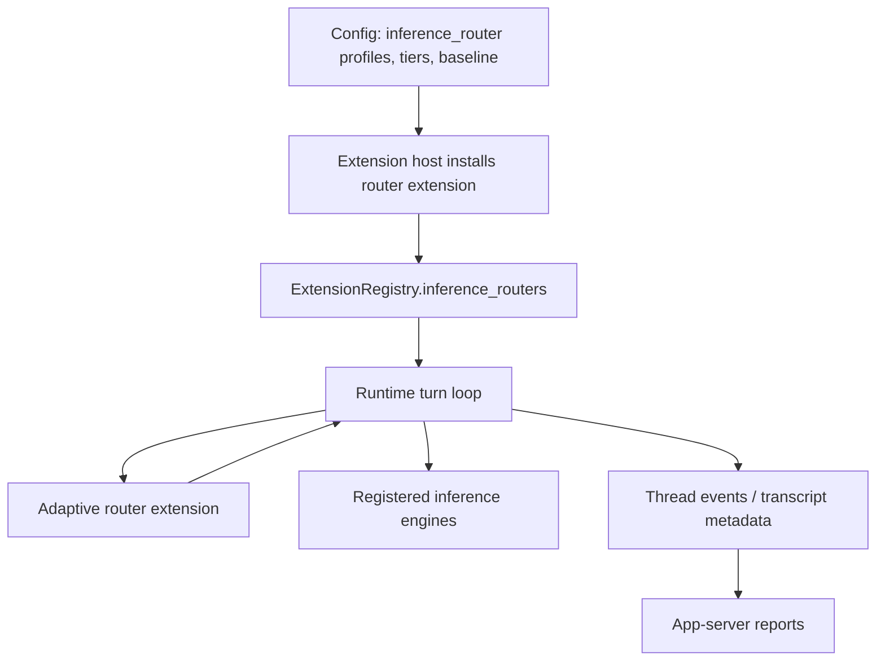
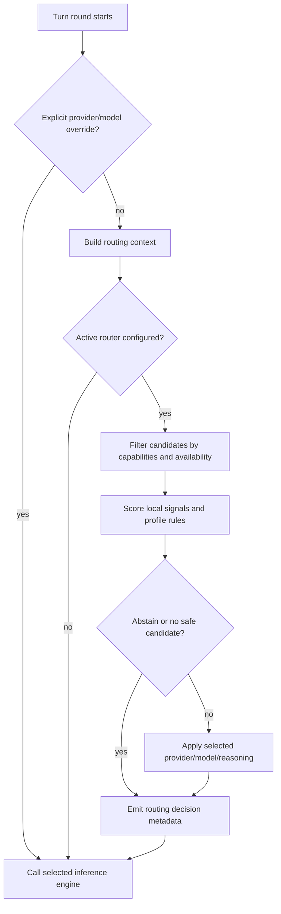
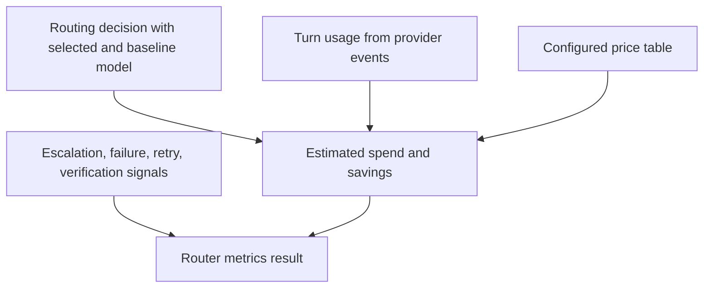

# feat: Add adaptive inference routing

## Summary

Add a first version of adaptive inference routing that lets Roder select a configured provider, model, and reasoning effort per model call using local runtime signals. The plan adds the stable Roder support surface first, then ships a bundled router extension that owns the initial routing policy, metadata, and savings estimates.

---

## Problem Frame

Roder currently chooses a provider and model before entering the turn loop, then adjusts reasoning only through existing mechanisms such as model profiles and eval-only speed policy. That makes every interactive model call use the same default model unless a user or workflow explicitly overrides it.

The goal is to test whether Roder's extension architecture can support model-spend shaping without using an external localhost gateway. Version one should be conservative: no cheap model classifier, no prompt compression, no cross-client proxying. It should use local signals Roder already owns, record why it routed, and leave enough trace data to compare a future cheap-model classifier against the local policy.

The "no cheap model classifier" constraint means v1 must not spend an extra model call to classify the turn. It can still route the real response request to configured lower-cost tiers when the local policy says that is safe.

---

## Requirements

- R1. Roder must expose a stable extension-facing routing contract that can inspect bounded turn state and return a provider, model, reasoning effort, or explicit abstain decision before each inference request.
- R2. Routing must be optional and disabled cleanly when no router is configured, when a turn has explicit provider/model overrides, or when a router abstains.
- R3. The first bundled router must use local runtime-aware signals only: turn phase, role/workflow hints, risk indicators, tool intent, prior failure/escalation state, capabilities, and configured profile rules.
- R4. Router decisions must enforce hard compatibility gates before selection, including registered provider, configured auth where applicable, model availability, reasoning support, image input, tool calling, structured output, and context-window suitability.
- R5. Routing profiles must be configurable without code changes, including baseline model selection, tier table, profile enablement, objective bias, risk floors, and future comparison metadata.
- R6. Roder must record routing metadata in a dedicated persisted thread event so users and later reports can inspect selected model, baseline, matched signals, decision confidence, abstain/escalation reason, and estimated cost delta.
- R7. Roder must expose basic estimated-savings and regret metrics from persisted events, with classifier-overhead fields reserved for a later cheap-model classifier.
- R8. The implementation must preserve provider neutrality: router extensions depend on `roder-api`, while `roder-core` depends only on the canonical routing trait and never on a concrete router extension.
- R9. App-server, protocol, docs, and ACP-visible surfaces must remain honest about active model behavior and must not advertise routing capabilities until the surfaced behavior is implemented and tested.

---

## Key Technical Decisions

- **Router as contributor, not inference engine:** The adaptive router participates in the inference lifecycle but does not own upstream model transport. Model providers remain `InferenceEngine`s; the router is a new extension registry slot that can recommend a selection before `Runtime` resolves the engine.
- **Core support before extension:** The first work unit creates the stable API, registry plumbing, runtime hook, and metadata shape. The router extension then implements local policy behind that surface.
- **Local policy first:** The MVP avoids cheap classifier calls. It combines deterministic local signals with profile configuration so later work can add a cheap-model classifier and compare it against the local decisions.
- **Local profiler is explicit state:** The bundled extension should treat its profiler as a small, inspectable signal extractor, not as hidden heuristics scattered through runtime. It produces named signals such as `phase:verification`, `risk:security`, `input:image`, `intent:file_lookup`, and `recovery:tool_failure`, and the policy layer consumes those signals.
- **Hard gates before scoring:** The router filters incompatible candidates before scoring tiers. This prevents routing to a cheap model that cannot handle images, tools, reasoning effort, or context size.
- **Abstain and fail-upward posture:** Uncertain, unsupported, or risky decisions keep the current/default model or route to a configured floor. The first version optimizes cost only after preserving correctness and trust.
- **Estimated savings, not billing truth:** Cost reporting is an estimate from configured price data and provider usage. It records baseline comparison and regret signals, but it does not claim exact billing because provider pricing, caching, subscriptions, and missing usage data vary.
- **Read-only router diagnostics:** App-server diagnostics should use a read-only `inference/routing/*` method family so routing is discoverable without pretending it is a model provider.

---

## High-Level Technical Design

### Component Shape



### Decision Flow



### Metrics Flow



---

## Scope Boundaries

### In Scope

- Add the Roder support surface required for routing extensions: API trait, registry slot, config resolution, runtime hook, metadata, and app-server reporting.
- Add one bundled router extension using local runtime signals and profile rules.
- Add estimated savings and regret reporting from persisted routing decisions and usage data.
- Document how extension authors can implement future routers.

### Deferred to Follow-Up Work

- Cheap-model classifier routing and comparison experiments.
- Prompt compression or token optimization.
- Hosted classifier or hosted optimization services.
- External localhost gateway compatibility for Codex, Claude Code, Gemini, or other clients.
- Automatic prompt rewriting or hidden context changes.
- Exact provider billing reconciliation beyond configured estimates.

---

## Core vs Extension Responsibilities

| Area | Roder support surface | Bundled router extension |
|---|---|---|
| API contract | Defines `InferenceRouter`, routing context, decisions, metadata, registry slot, and public DTOs. | Implements the trait with local policy. |
| Config plumbing | Parses generic `inference_router` config and passes resolved config into runtime and extension host. | Interprets profile rules, tiers, objectives, risk floors, and prices. |
| Runtime integration | Builds bounded turn context, validates selected provider/model/reasoning, applies decisions, and emits metadata. | Scores local signals and returns selected, abstain, or escalate decisions. |
| Provider interaction | Keeps real model transport in existing `InferenceEngine`s. | Never calls providers in v1 and never proxies traffic. |
| Reporting | Provides persisted event/protocol surfaces and read-only diagnostics. | Supplies decision details and price assumptions used by reports. |
| Future classifier path | Reserves metadata fields and comparison hooks. | Later work can add a cheap-model classifier behind the same trait. |

The core should not contain router-specific scoring rules, risk keyword tables, or model-tier opinions. Those belong in the bundled extension so replacing the local profiler with another router proves the extension boundary is real.

---

## Output Structure

```text
crates/roder-ext-inference-router/
  Cargo.toml
  src/
    lib.rs
    extension.rs
    policy.rs
    signals.rs
    profiler.rs
    scoring.rs
  tests/
    router_policy.rs
```

---

## Implementation Units

### U1. Inference routing contract and registry support

**Goal:** Define the canonical routing trait, request/decision types, provider service entry, registry storage, and duplicate-id validation.

**Requirements:** R1, R2, R4, R8

**Dependencies:** None

**Files:**

- `crates/roder-api/src/inference.rs`
- `crates/roder-api/src/inference_routing.rs`
- `crates/roder-api/src/extension.rs`
- `crates/roder-api/src/lib.rs`
- `crates/roder-api/tests/extension_api_compat.rs`

**Approach:** Add a provider-neutral `InferenceRouter` contributor trait in `roder-api`, with typed routing context, candidate, decision, signal, and estimation records. Keep the routing context bounded: thread id, turn id, runtime profile, requested/default selection, transcript summary counts, tool availability, image presence, current phase, prior failure/escalation indicators, and candidate model descriptors. Add `ProvidedService::InferenceRouter`, registry builder storage, lookup helpers, and validation consistent with other registry categories.

**Patterns to follow:** Extension registry slot patterns in `crates/roder-api/src/extension.rs`, capability modeling in `crates/roder-api/src/inference.rs`, and the VCS provider plan's split between stable API and bundled implementation.

**Test scenarios:**

- In `crates/roder-api/src/inference_routing.rs`, router context, candidate, decision, signal, and cost estimate records serialize and deserialize with stable camelCase public fields.
- In `crates/roder-api/src/extension.rs`, a fake router extension advertises `ProvidedService::InferenceRouter` and appears in the built registry.
- In `crates/roder-api/src/extension.rs`, duplicate router ids fail registry validation with a clear error.
- In `crates/roder-api/tests/extension_api_compat.rs`, external-style code can implement the router trait without importing `roder-core`.
- In `crates/roder-api/src/inference_routing.rs`, abstain, selected, and fallback decisions all carry a reason and optional confidence.

**Verification:** `roder-api` exposes routing as a stable extension-facing contract and no concrete router implementation is required for the crate to compile.

### U2. Config model and startup wiring

**Goal:** Parse user configuration for adaptive routing and pass resolved router settings into runtime and the bundled extension host.

**Requirements:** R2, R5, R8

**Dependencies:** U1

**Files:**

- `crates/roder-config/src/lib.rs`
- `crates/roder-cli/src/main.rs`
- `crates/roder-core/src/runtime.rs`
- `crates/roder-extension-host/src/lib.rs`
- `docs/roder-inference-routing.md`

**Approach:** Add an `inference_router` config section with a generic enabled flag, active router id, active profile, baseline selection, and opaque extension table. Resolve runtime-owned enablement/baseline settings into `RuntimeConfig`, and pass the opaque extension table through the extension host so the bundled local router owns its own tier definitions, objective bias, risk floors, classifier-comparison placeholder, and optional price table. Register the bundled router for discovery when the crate is compiled into the extension host, but activate it for routing only when config enables it and names the router/profile.

**Patterns to follow:** `speed_policy`, `model_profiles`, `provider_tool_search`, and `model_tool_search` parsing in `crates/roder-config/src/lib.rs` and `crates/roder-cli/src/main.rs`.

**Test scenarios:**

- In `crates/roder-config/src/lib.rs`, a minimal disabled config parses and defaults to no routing.
- In `crates/roder-config/src/lib.rs`, a profile with baseline plus an opaque extension table containing tiers, risk floors, prices, and explicitly defined classifier-comparison placeholder fields roundtrips without losing configured values.
- In `crates/roder-cli/src/main.rs`, resolved runtime config preserves routing disabled when no section exists.
- In `crates/roder-cli/src/main.rs`, invalid provider/model references in configured tiers fail fast or are marked unavailable according to the chosen validation behavior.
- In `crates/roder-extension-host/src/lib.rs`, the bundled router extension is discoverable from the registry but produces no active routing decisions until enabled config selects it.

**Verification:** Users can configure routing without code changes, and startup behavior remains unchanged when the section is absent.

### U3. Runtime routing hook and decision metadata

**Goal:** Insert the routing decision before per-round engine resolution and persist inspectable routing metadata.

**Requirements:** R1, R2, R4, R6, R8

**Dependencies:** U1, U2

**Files:**

- `crates/roder-core/src/runtime.rs`
- `crates/roder-core/src/inference_routing.rs`
- `crates/roder-core/src/speed_policy.rs`
- `crates/roder-api/src/events.rs`
- `crates/roder-api/src/thread/projection.rs`
- `crates/roder-core/tests/agent_loop.rs`

**Approach:** Move provider/model/reasoning resolution into a per-round selection step that can call the active router before `engine_for`. The runtime builds candidate data from registered engines and model descriptors, asks the router for a decision, validates the result against capabilities and reasoning support, then builds `AgentInferenceRequest` with the selected model. Emit a dedicated `InferenceRoutingDecision` event before `InferenceStarted`, and include the final selected provider/model/reasoning on `InferenceStarted` so clients do not need to parse provider metadata to understand the actual model used.

**Patterns to follow:** Existing `SpeedPolicyState` phase tracking, `InferenceStarted` event emission, `AgentInferenceRequest.metadata`, `TranscriptItem::ProviderMetadata`, and `model_profile_segment_metadata`.

**Test scenarios:**

- In `crates/roder-core/tests/agent_loop.rs`, a fake router selects a different registered provider/model and the captured `AgentInferenceRequest.model` uses that selection.
- In `crates/roder-core/tests/agent_loop.rs`, explicit turn-level provider/model overrides bypass routing.
- In `crates/roder-core/tests/agent_loop.rs`, router abstain preserves the default provider/model and records an abstain reason.
- In `crates/roder-core/tests/agent_loop.rs`, a router decision for a model without required image support fails upward or abstains before sending the request.
- In `crates/roder-core/tests/agent_loop.rs`, selected reasoning effort is validated against the selected model and degrades according to configured fallback.
- In `crates/roder-api/src/thread/projection.rs`, routing metadata persists in event replay without changing existing turn usage projection.

**Verification:** Runtime can route each inference request through an extension-owned decision while preserving existing behavior when routing is disabled.

### U4. Bundled local adaptive router extension

**Goal:** Implement the first router extension with local profile/risk/phase/tool-intent rules and conservative escalation.

**Requirements:** R3, R4, R5, R6, R8

**Dependencies:** U1, U2, U3

**Files:**

- `Cargo.toml`
- `crates/roder-extension-host/Cargo.toml`
- `crates/roder-extension-host/src/lib.rs`
- `crates/roder-ext-inference-router/Cargo.toml`
- `crates/roder-ext-inference-router/src/lib.rs`
- `crates/roder-ext-inference-router/src/extension.rs`
- `crates/roder-ext-inference-router/src/policy.rs`
- `crates/roder-ext-inference-router/src/signals.rs`
- `crates/roder-ext-inference-router/src/profiler.rs`
- `crates/roder-ext-inference-router/src/scoring.rs`
- `crates/roder-ext-inference-router/tests/router_policy.rs`

**Approach:** Create a bundled extension crate that registers an `InferenceRouter`. The router extracts local signals through `profiler.rs` from the bounded context: initial orientation, execution after tools, verification, recovery after provider/tool failure, image presence, likely tool use, multi-file or long-context indicators, security/sandbox/data-risk keywords, and role/profile hints. It maps those signals to configured tiers after hard compatibility gates. It returns selected, abstain, or escalate decisions with matched signals and confidence.

**Patterns to follow:** First-party extension crates such as `crates/roder-ext-verification`, `crates/roder-ext-task-ledger`, and `crates/roder-ext-web-search`; speed-policy phase concepts from `crates/roder-core/src/speed_policy.rs`; extension API guidance in `docs/roder-extension-api.md`.

**Test scenarios:**

- In `crates/roder-ext-inference-router/tests/router_policy.rs`, a routine read/search profile routes to the configured cheap tier when capabilities match.
- In `crates/roder-ext-inference-router/tests/router_policy.rs`, security, sandbox, auth, secret, and data-loss signals enforce a configured high-risk floor.
- In `crates/roder-ext-inference-router/tests/router_policy.rs`, image-bearing turns reject non-image-capable candidates and choose a capable tier or abstain.
- In `crates/roder-ext-inference-router/tests/router_policy.rs`, verification and recovery phases escalate relative to execution phase.
- In `crates/roder-ext-inference-router/tests/router_policy.rs`, missing tier configuration or missing model descriptors produce abstain decisions rather than panics.
- In `crates/roder-extension-host/src/lib.rs`, default registry construction can install the router extension with parsed config and no provider credentials of its own.

**Verification:** The extension can make useful local routing decisions without depending on `roder-core` internals or making classifier model calls.

### U5. Estimated savings and regret metrics

**Goal:** Compute basic estimated savings and quality-regret signals from persisted routing decisions and token usage.

**Requirements:** R6, R7

**Dependencies:** U3, U4

**Files:**

- `crates/roder-api/src/inference_routing.rs`
- `crates/roder-app-server/src/server.rs`
- `crates/roder-protocol/src/lib.rs`
- `crates/roder-protocol/src/methods.rs`
- `crates/roder-app-server/tests/e2e.rs`
- `docs/app-server/api.md`
- `docs/roder-inference-routing.md`

**Approach:** Add read-only `inference/routing/status` and `inference/routing/metrics` methods that aggregate router decisions, selected-versus-baseline estimates, usage availability, abstains, escalations, provider failures, verification-triggered follow-up, and retry-after-low-tier markers. Keep calculations approximate and transparent: every estimate should identify price source, usage source, and whether cached-token pricing was applied. Reserve classifier-overhead fields as zero/absent in v1 so later classifier comparisons can reuse the schema.

**Patterns to follow:** Retrieval router diagnostics in `docs/roder-search-router.md`, usage projection in `crates/roder-api/src/thread.rs`, app-server notification and `turn/completed` usage tests in `crates/roder-app-server/tests/e2e.rs`.

**Test scenarios:**

- In `crates/roder-app-server/src/inference_routing.rs`, `inference/routing/status` reports empty status for a thread with no routing events and latest status when routing events exist.
- In `crates/roder-app-server/tests/e2e.rs`, `inference/routing/metrics` returns empty totals for a thread with no routing events.
- In `crates/roder-app-server/tests/e2e.rs`, a routed turn with usage and configured prices reports selected estimate, baseline estimate, and estimated savings.
- In `crates/roder-app-server/tests/e2e.rs`, missing usage marks estimates as unavailable rather than zero-cost.
- In `crates/roder-app-server/tests/e2e.rs`, cached prompt tokens affect estimates only when the price table includes cached-token pricing.
- In `crates/roder-app-server/tests/e2e.rs`, follow-up escalation or verification failure increments regret counters without altering token usage.

**Verification:** Users can inspect router value and router mistakes from JSONL-backed data without trusting a hidden billing calculation.

### U6. Protocol, docs, and ACP compatibility pass

**Goal:** Keep public client surfaces, schemas, and docs aligned with adaptive routing behavior.

**Requirements:** R5, R6, R7, R9

**Dependencies:** U1, U2, U3, U4, U5

**Files:**

- `crates/roder-protocol/src/lib.rs`
- `crates/roder-protocol/src/methods.rs`
- `crates/roder-app-server/src/server.rs`
- `crates/roder-app-server/tests/e2e.rs`
- `schemas/app-server/roder-app-server.v1.json`
- `schemas/app-server/methods.schema.json`
- `docs/app-server/api.md`
- `docs/app-server/protocol.md`
- `docs/roder-extension-api.md`
- `docs/roder-inference-routing.md`
- `README.md`

**Approach:** Treat app-server and ACP-facing behavior as public contracts. Add method specs and schemas for router status/metrics only after handlers exist. Ensure `initialize`, provider/model selection, `model/list`, `providers/list`, and turn notifications remain understandable when routing changes the actual model used for a turn. If ACP cannot expose router-specific status yet, document that routing is runtime behavior and avoid advertising unsupported ACP capabilities.

**Patterns to follow:** Method specs in `crates/roder-protocol/src/methods.rs`, API examples in `docs/app-server/api.md`, and the `maintain-acp-compliance` checklist.

**Test scenarios:**

- In `crates/roder-app-server/tests/e2e.rs`, routed turns emit events or notifications that let a client distinguish default model from actual routed model.
- In `crates/roder-app-server/tests/e2e.rs`, `providers/list` and `model/list` continue to expose real providers and models rather than inventing a fake routed provider.
- In `crates/roder-protocol/src/methods.rs`, `inference/routing/status` and `inference/routing/metrics` are read-only and idempotent.
- In `crates/roder-app-server/tests/e2e.rs`, router status and metrics methods reject invalid thread ids or malformed params with structured JSON-RPC errors.
- In docs, examples show disabled config, a local routing profile, and estimated savings caveats without promising cheap-model classification.

**Verification:** Client-visible contracts and docs describe only implemented routing behavior, and ACP-facing surfaces are either covered or explicitly unchanged.

---

## Acceptance Examples

- **Disabled config preserves existing behavior**
  - **Given:** No `inference_router` config is present.
  - **When:** A user starts a turn with the default provider and model.
  - **Then:** Runtime sends the request to the existing default selection and emits no selected-route metadata.

- **Routine turn routes down**
  - **Given:** Routing is enabled with a profile whose simple tier points at a cheaper model.
  - **When:** A turn has local signals for read/search or simple execution and the candidate supports required capabilities.
  - **Then:** Runtime sends the inference request to the simple tier and records the matched signals, selected model, and baseline model.

- **Risk floor routes up**
  - **Given:** Routing is enabled with a high-risk floor for security and sandbox work.
  - **When:** The turn contains auth, sandbox, secret, or destructive-data signals.
  - **Then:** The router selects at least the configured high-risk tier or abstains upward if no safe candidate exists.

- **Unsupported candidate abstains**
  - **Given:** The cheap tier points at a model without image input.
  - **When:** The user sends a turn with an image.
  - **Then:** The router rejects the cheap candidate and either selects an image-capable tier or keeps the current/default model.

- **Savings report is explicit about uncertainty**
  - **Given:** A routed turn completes with token usage and configured prices.
  - **When:** A client reads router metrics.
  - **Then:** The report shows selected estimate, baseline estimate, estimated savings, and whether the estimate used reported usage, cached-token pricing, or incomplete data.

---

## System-Wide Impact

- **Runtime:** Provider/model resolution becomes per-round instead of only pre-turn, and routing metadata becomes part of the persisted turn story.
- **Extension API:** A new contributor category tests whether lifecycle policy can live in extensions without making providers or core depend on each other.
- **Configuration:** Users gain a new routing config surface that can affect actual model spend and quality, so defaults must remain off or conservative.
- **App-server and clients:** Clients that show model identity need access to actual routed model metadata, not only thread defaults.
- **Evals and goals:** Speed policy and goal usage accounting must keep working when a routed turn uses different models across rounds.

---

## Risks & Dependencies

- **Architecture overreach:** A full router framework could swallow model profiles, speed policy, and workflow routing. Mitigation: keep v1 narrow and make the router a contributor that recommends selection, not a replacement for every model policy.
- **Hidden quality regressions:** Cost savings can mask worse answers. Mitigation: track regret signals beside savings and fail upward on uncertainty.
- **Client confusion:** Thread default model and actual routed model can diverge. Mitigation: persist actual routed model in events/metadata and document the distinction.
- **Provider capability drift:** Dynamic provider models may change between config and runtime. Mitigation: validate candidates per call against registered engines and model descriptors.
- **Pricing drift:** Provider prices change and subscriptions vary. Mitigation: label savings as estimates and require configured price tables or known built-in price metadata before reporting dollar values.
- **ACP compatibility:** Model/config behavior can affect ACP clients even if no new ACP method is added. Mitigation: include wire-level app-server tests and update docs only for implemented surfaces.
- **Concurrent repo work:** Multiple agents work in this repo. Implementation should ignore unrelated dirty work and avoid broad refactors outside the listed files.

---

## Documentation / Operational Notes

- Add `docs/roder-inference-routing.md` as the extension-author and user configuration guide.
- Update `docs/roder-extension-api.md` with the new `InferenceRouter` contributor category and capability expectations.
- Update `docs/app-server/api.md` with router status/metrics examples after the methods exist.
- Note in docs that v1 does not call a cheap classifier model and does not compress prompts.
- Add migration-free guidance only; this project is moving quickly and should not carry legacy aliases for experimental config names.

---

## Sources / Research

- Current inference request and provider contract: `crates/roder-api/src/inference.rs`
- Current extension registry pattern: `crates/roder-api/src/extension.rs`, `crates/roder-extension-host/src/lib.rs`
- Current runtime model selection path: `crates/roder-core/src/runtime.rs`
- Current speed-policy phase pattern: `crates/roder-core/src/speed_policy.rs`, `docs/roder-speed-policy.md`
- Current retrieval-router diagnostics pattern: `docs/roder-search-router.md`
- Current config resolution path: `crates/roder-config/src/lib.rs`, `crates/roder-cli/src/main.rs`
- Current app-server provider/model and usage surfaces: `crates/roder-app-server/src/server.rs`, `docs/app-server/api.md`
- Extension architecture doctrine: `roadmap/foundations/roder_extensibility_foundations_extensions.md`
- Related provider-subsystem plan: `docs/plans/2026-06-01-001-feat-vcs-provider-extension-plan.md`
- ACP compatibility checklist: `.agents/skills/maintain-acp-compliance/SKILL.md`
- Prior-art context from discussion: GitHub Copilot auto model selection, Claude Code phase/model tiering, OpenCode small-model configuration, Pi StarRouter local profiler and explainability posture, OpenRouter fallback routing.
