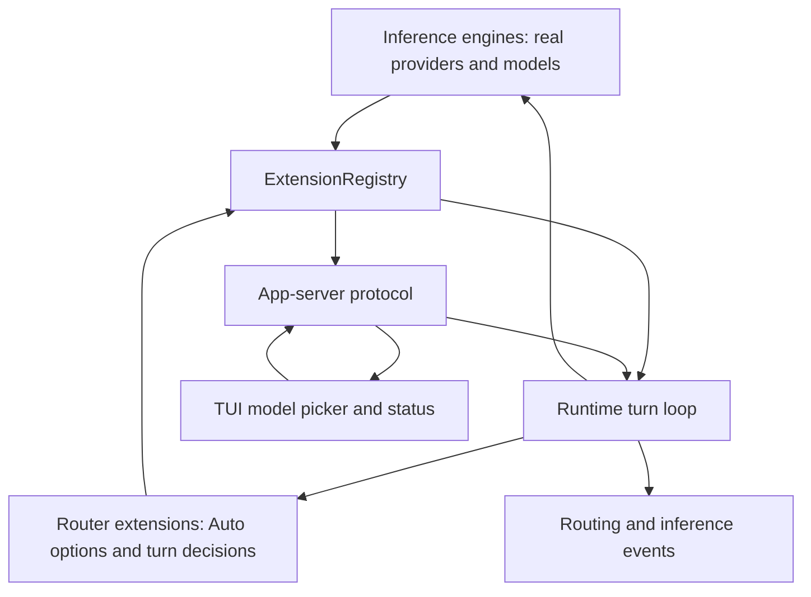
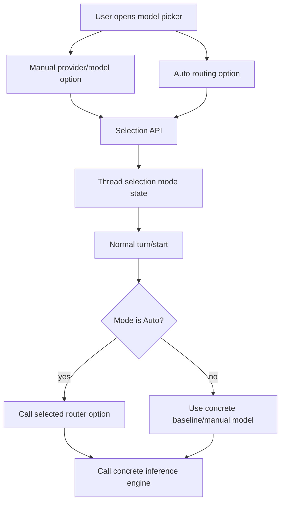
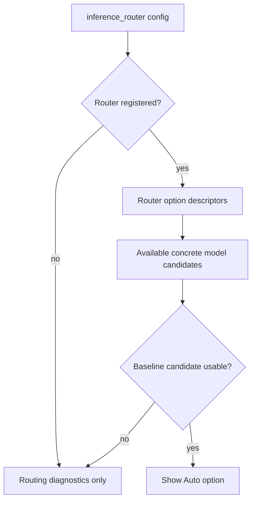

# feat: Add auto model selection mode

## Summary

Add a first-class Auto model selection mode for Roder so users can opt into adaptive inference routing from the model picker without representing Auto as a fake provider or fake model. Manual selections continue to execute a concrete provider/model directly, while Auto selections invoke a configured routing option that resolves to a concrete provider/model/reasoning choice per turn.

---

## Problem Frame

The first adaptive routing implementation proves the runtime can call an `InferenceRouter` before inference, but the current lab path makes routing feel implicit: a thread still appears to have a concrete selected model even when the router may choose another model for the turn. That is workable for architecture validation, but it blurs product semantics.

Roder needs an explicit user-facing Auto option that preserves responsibility boundaries. Inference providers should advertise and execute real models. Router extensions should advertise routeable policies and make turn-level choices. Runtime and protocol should carry the selected mode honestly so thread state, TUI status, routing events, and model execution do not disagree.

---

## Requirements

- R1. Roder must expose Auto only when a configured, registered inference router provides at least one usable routing option.
- R2. Auto must be represented as a selection mode, not as `provider = "auto"` or `model = "auto"`.
- R3. Router extensions must contribute route options through an extension-facing routing option contract rather than mutating provider model lists or registering fake inference providers.
- R4. Manual model selection must bypass routing during normal turns.
- R5. Auto model selection must invoke routing during normal turns and pass the selected routing option/profile into the routing context.
- R6. Thread state, thread start/read/list results, provider/model picker data, and TUI status must distinguish Auto mode from Manual mode while still exposing the latest concrete baseline and routed inference model where useful.
- R7. Auto options must be hidden from the main picker when routing is disabled, the router is missing, or the option cannot resolve to a safe baseline/candidate set.
- R8. Routing diagnostics must report why Auto is unavailable without making broken options selectable.
- R9. App-server protocol docs, schemas, and method metadata must reflect the new selection-mode surface.

---

## Key Technical Decisions

- **Auto is a mode, not a model:** Store Auto as a typed selection mode with router/profile/option identity and a concrete baseline. Concrete provider/model fields remain real model references.
- **Router options are sibling picker data:** Extend the model-picker data returned by app-server with router-contributed Auto options as a sibling list to real provider models. Do not insert Auto into `ProviderDescriptor.models`.
- **Selection API carries intent:** Promote a canonical `model/select` method that accepts a typed manual-or-auto selection. Update TUI and protocol docs to use it instead of stretching `providers/select` to cover non-provider Auto choices.
- **Runtime routes only in Auto mode:** Replace the current routeability inference with explicit turn selection intent. Manual mode and per-turn concrete overrides bypass routing; Auto mode calls the router.
- **Thread metadata keeps both truth layers:** Persist the selection mode alongside concrete baseline provider/model so thread resume/list can show Auto while runtime still has a safe fallback model.
- **Unavailable Auto stays diagnostic-only:** Main picker options should be actionable. Broken routing configuration belongs in routing status/settings diagnostics, not in the selectable model list.

---

## High-Level Technical Design

### Responsibility Topology

### Selection Mode Flow

### Availability Gate

---

## Scope Boundaries

### In Scope

- Add typed selection mode support for Manual and Auto model selection.
- Add router-contributed Auto option descriptors and app-server picker exposure.
- Update runtime turn startup so routing is driven by Auto mode rather than by absence of model fields.
- Update TUI model picker, status text, thread state handling, and tests for Auto.
- Update protocol schemas, app-server docs, routing docs, and lab instructions.

### Deferred to Follow-Up Work

- Cheap-model classifier routing.
- Prompt compression or token optimization.
- Hosted routing services.
- Cross-client localhost proxy behavior.
- Exact provider billing reconciliation.
- Rich settings UI for editing router profiles; this plan only surfaces configured options.

---

## Implementation Units

### U1. Router option descriptor contract

**Goal:** Let router extensions advertise selectable Auto options without pretending to be inference providers.

**Requirements:** R1, R2, R3, R7, R8

**Dependencies:** None

**Files:**

- `crates/roder-api/src/inference_routing.rs`
- `crates/roder-api/src/extension.rs`
- `crates/roder-api/tests/extension_api_compat.rs`
- `crates/roder-ext-inference-router/src/extension.rs`
- `crates/roder-ext-inference-router/src/config.rs`
- `crates/roder-ext-inference-router/src/policy.rs`
- `crates/roder-ext-inference-router/tests/router_policy.rs`

**Approach:** Add a routing option descriptor to the extension API with stable identity, label, router id, optional profile, objective, concrete baseline selection, and availability diagnostics. Extend the router contract or registry helper so app-server can list options without invoking turn routing. The bundled local router should emit one option per configured profile that has enough tier/baseline data to be selectable.

**Patterns to follow:** Existing `InferenceRouter` trait and registry slot in `crates/roder-api/src/inference_routing.rs` and `crates/roder-api/src/extension.rs`; local router config parsing in `crates/roder-ext-inference-router/src/config.rs`.

**Test scenarios:**

- In `crates/roder-api/src/inference_routing.rs`, routing option descriptors serialize with stable camelCase fields and round-trip through JSON.
- In `crates/roder-api/tests/extension_api_compat.rs`, an external-style router can expose route options without depending on `roder-core`.
- In `crates/roder-ext-inference-router/tests/router_policy.rs`, a local router with a configured `coding` profile exposes an Auto option whose baseline matches `inference_router.baseline_provider` and `baseline_model`.
- In `crates/roder-ext-inference-router/tests/router_policy.rs`, a local router with missing baseline or missing profile data reports an unavailable option with a diagnostic reason and does not mark it selectable.

**Verification:** Router extensions can describe selectable Auto policies independently of real provider model lists.

### U2. Selection mode protocol and persistence model

**Goal:** Add Manual and Auto model selection types to protocol and thread state while preserving concrete provider/model fields as real model references.

**Requirements:** R2, R4, R5, R6, R9

**Dependencies:** U1

**Files:**

- `crates/roder-api/src/thread.rs`
- `crates/roder-api/src/inference.rs`
- `crates/roder-protocol/src/lib.rs`
- `crates/roder-protocol/src/methods.rs`
- `crates/roder-core/src/runtime.rs`
- `crates/roder-core/src/transcript.rs`
- `crates/roder-core/tests/agent_loop.rs`
- `schemas/app-server/roder-app-server.v1.json`
- `schemas/app-server/methods.schema.json`

**Approach:** Introduce a typed selection mode shape shared by thread metadata and protocol responses. Manual mode carries concrete provider/model/reasoning. Auto mode carries router option id, router id, profile, baseline provider/model/reasoning, and a display label. Keep existing concrete `provider` and `model` metadata populated with the baseline so storage and fallback remain simple, but add selection mode as the source of truth for whether routing is active.

**Patterns to follow:** Thread metadata evolution in `crates/roder-api/src/thread.rs`; app-server method manifest patterns in `crates/roder-protocol/src/methods.rs`.

**Test scenarios:**

- In `crates/roder-api/src/thread.rs`, older thread metadata without selection mode deserializes as Manual using its concrete provider/model.
- In `crates/roder-api/src/thread.rs`, Auto thread metadata round-trips with baseline provider/model and router option identity.
- In `crates/roder-protocol/src/lib.rs`, thread and thread-start responses serialize selection mode while keeping concrete provider/model fields real.
- In `crates/roder-protocol/src/methods.rs`, any new or changed app-server methods appear in the method manifest with the right mutability and idempotency.
- In `crates/roder-core/src/transcript.rs`, thread snapshots preserve Auto mode across load/list/read flows.

**Verification:** Stored and protocol-visible thread state can say "Auto" without ever storing `auto` as a provider or model id.

### U3. App-server selection and option listing

**Goal:** Surface routeable Auto options to clients and let clients select Manual or Auto with explicit intent.

**Requirements:** R1, R3, R6, R7, R8, R9

**Dependencies:** U1, U2

**Files:**

- `crates/roder-app-server/src/server.rs`
- `crates/roder-app-server/src/inference_routing.rs`
- `crates/roder-app-server/tests/e2e.rs`
- `crates/roder-app-server/tests/turn_start_steering.rs`
- `crates/roder-protocol/src/lib.rs`
- `docs/app-server/api.md`
- `docs/app-server/protocol.md`

**Approach:** Extend the app-server picker data with a `routingOptions` sibling list and an active `selectionMode`. Add `model/select` as the canonical selection method for both Manual and Auto choices, and migrate TUI callers off `providers/select` for model picker actions. The server should validate Auto options against registered routers and concrete candidates before writing thread/default state. Unavailable routing should remain visible through `inference/routing/status` or a diagnostics payload, not as a selectable picker option.

**Patterns to follow:** `handle_providers_list`, `handle_provider_select`, `handle_inference_routing_status`, and e2e request helpers in `crates/roder-app-server/tests/e2e.rs`.

**Test scenarios:**

- In `crates/roder-app-server/tests/e2e.rs`, `providers/list` returns real providers unchanged and adds a selectable Auto option only when the local router is enabled and registered.
- In `crates/roder-app-server/tests/e2e.rs`, `providers/list` omits selectable Auto options when routing config is disabled, the router id is missing, or the router is not registered.
- In `crates/roder-app-server/tests/e2e.rs`, `model/select` with Manual stores Manual mode and updates concrete provider/model/reasoning.
- In `crates/roder-app-server/tests/e2e.rs`, `model/select` with Auto stores Auto mode with the configured baseline and returns a result that names Auto plus the baseline.
- In `crates/roder-app-server/tests/e2e.rs`, `model/select` with an unavailable Auto option returns a JSON-RPC invalid-params error with the diagnostic reason.
- In `crates/roder-app-server/tests/turn_start_steering.rs`, steering an active turn does not change the selection mode or accidentally re-run option selection.

**Verification:** App-server exposes Auto as route selection state, not as provider mutation, and clients can inspect why Auto is or is not available.

### U4. Runtime turn routing by selection mode

**Goal:** Make the runtime route only when the active selection mode is Auto, and bypass routing for Manual selections.

**Requirements:** R2, R4, R5, R6

**Dependencies:** U2, U3

**Files:**

- `crates/roder-core/src/runtime.rs`
- `crates/roder-core/src/inference_routing.rs`
- `crates/roder-core/src/goals.rs`
- `crates/roder-app-server/src/automation_worker.rs`
- `crates/roder-evals/src/runner.rs`
- `crates/roder-core/tests/agent_loop.rs`
- `crates/roder-core/tests/provider_stream_retry.rs`
- `crates/roder-core/tests/reliability_limits.rs`

**Approach:** Replace the current "explicit model selection" routeability heuristic with selection-mode intent. `StartTurnRequest` should carry Manual or Auto mode plus any per-turn explicit override. Manual mode resolves directly to its concrete provider/model. Auto mode passes router id, option id, profile, baseline, and candidate list to `route_inference_selection`. Per-turn concrete overrides remain explicit and bypass routing.

**Patterns to follow:** Current routing hook and `InferenceRoutingRequest` flow in `crates/roder-core/src/runtime.rs`; fallback handling in `crates/roder-core/src/inference_routing.rs`.

**Test scenarios:**

- In `crates/roder-core/src/runtime.rs`, Manual mode with routing configured does not call the router and emits no routing decision.
- In `crates/roder-core/src/runtime.rs`, Auto mode calls the selected router and emits a routing decision before `InferenceStarted`.
- In `crates/roder-core/src/runtime.rs`, Auto mode falls back to the baseline when the router abstains or returns an unavailable candidate.
- In `crates/roder-core/src/runtime.rs`, a concrete per-turn provider/model override bypasses Auto for that turn without mutating the thread's Auto selection.
- In `crates/roder-core/tests/provider_stream_retry.rs`, provider retry and reliability loops preserve the same Auto option identity across retries.
- In `crates/roder-evals/src/runner.rs`, eval fixtures that specify concrete models continue to run in Manual mode.

**Verification:** Routing is no longer inferred from missing model fields; it is driven by explicit Auto mode.

### U5. TUI Auto picker and status behavior

**Goal:** Let users select Auto from the model picker and see honest status for Auto mode and routed concrete models.

**Requirements:** R1, R2, R4, R5, R6, R7

**Dependencies:** U3, U4

**Files:**

- `crates/roder-tui/src/app.rs`
- `crates/roder-tui/src/palette/sources.rs`
- `crates/roder-tui/tests/api_replay.rs`

**Approach:** Split the TUI's provider model option type into Manual and Auto variants. Render Auto options at the top of the model list when available, grouped separately from provider sections. Selecting Auto should call the typed selection API and set local status to Auto with the configured label. Turn start should send no concrete model override for normal prompts; app-server resolves the thread's mode. Timeline/status rows should display routed concrete models from `InferenceStarted` and routing events, while the persistent picker state remains Auto.

**Patterns to follow:** Provider menu option building in `provider_options_from_list`, `models_menu_items`, `select_provider_model`, and the request-capture tests around `start_prepared_prompt`.

**Test scenarios:**

- In `crates/roder-tui/src/app.rs`, provider option construction includes Auto options before concrete provider sections when `routingOptions` are present.
- In `crates/roder-tui/src/app.rs`, provider option construction excludes unavailable Auto diagnostics from the selectable model list.
- In `crates/roder-tui/src/app.rs`, selecting Auto sends the typed Auto selection payload and updates local provider/model display to the Auto label plus baseline detail.
- In `crates/roder-tui/src/app.rs`, selecting a concrete model sends Manual selection and causes future normal turns to bypass routing.
- In `crates/roder-tui/src/app.rs`, normal prompt submission in Auto mode still omits concrete model fields from `turn/start`.
- In `crates/roder-tui/src/palette/sources.rs`, palette model actions do not expose broken Auto options and do not treat Auto as a provider id.

**Verification:** Users can deliberately choose Auto, see that Auto is active, and still inspect which concrete model each routed turn used.

### U6. Documentation, lab flow, and diagnostics polish

**Goal:** Update user and integrator documentation so Auto mode is the blessed way to exercise routing.

**Requirements:** R6, R8, R9

**Dependencies:** U1, U2, U3, U4, U5

**Files:**

- `docs/roder-inference-routing.md`
- `docs/roder-extension-api.md`
- `docs/app-server/api.md`
- `docs/app-server/protocol.md`
- `scripts/roder-inference-routing-lab-setup.sh`
- `scripts/roder-inference-routing-lab-tail.sh`
- `scripts/roder-inference-routing-lab-metrics.sh`

**Approach:** Reframe the lab instructions around selecting Auto after the routing config is prepared. Document the separation between real provider models and Auto routing options. Keep the tail and metrics scripts focused on persisted routing and inference events; update wording only if event shape changes. App-server docs should show Manual and Auto selection examples and explain unavailable Auto diagnostics.

**Patterns to follow:** Existing routing docs and lab scripts added for the adaptive routing MVP.

**Test scenarios:**

- In `scripts/roder-inference-routing-lab-setup.sh`, generated config still produces a valid router profile and baseline after Auto becomes opt-in.
- In `scripts/roder-inference-routing-lab-tail.sh`, routing decisions and `InferenceStarted` events still render concrete selected models, not Auto pseudo-models.
- In docs examples, Auto selection requests include router option identity and baseline fields, while Manual examples include concrete provider/model.

**Verification:** A user can set up the lab, select Auto in the TUI, run a turn, and observe both `ROUTE` and concrete `START` lines.

---

## System-Wide Impact

This change affects the public app-server protocol, persisted thread metadata, runtime turn semantics, extension API, TUI model selection UX, and generated schemas. It should be treated as a cross-surface protocol change: every new protocol field needs schema/docs coverage, and every existing surface that displays a thread model must decide whether it shows persistent selection mode, concrete baseline, latest routed model, or all of them.

---

## Risks & Dependencies

- **Protocol drift:** `providers/list`, selection results, thread results, docs, and schemas can easily drift. Mitigation: make protocol tests assert the complete Manual and Auto shapes.
- **Thread resume ambiguity:** Existing thread metadata has only concrete provider/model. Mitigation: deserialize missing selection mode as Manual and write Auto mode only for new Auto selections.
- **UI confusion:** Showing Auto and concrete routed models in the same view can read as contradiction. Mitigation: use stable labels such as `Auto: Coding` for persistent mode and `routed to codex/gpt-5.4-mini` for per-turn events.
- **Unavailable option leakage:** Broken router config should not create dead picker rows. Mitigation: separate selectable `routingOptions` from diagnostic status.
- **Responsibility creep:** The app-server should compose option lists but not implement routing policy. Mitigation: keep scoring/profile interpretation in router extensions.

---

## Sources & Research

- Prior completed plan: `docs/plans/2026-06-06-001-feat-adaptive-inference-routing-plan.md`.
- Current router contract and routing context: `crates/roder-api/src/inference_routing.rs`.
- Current runtime routing hook and fallback path: `crates/roder-core/src/runtime.rs`, `crates/roder-core/src/inference_routing.rs`.
- Current provider/model protocol and selection flow: `crates/roder-protocol/src/lib.rs`, `crates/roder-app-server/src/server.rs`.
- Current TUI picker construction and selection behavior: `crates/roder-tui/src/app.rs`.
- Local router config and policy implementation: `crates/roder-ext-inference-router/src/config.rs`, `crates/roder-ext-inference-router/src/policy.rs`.
